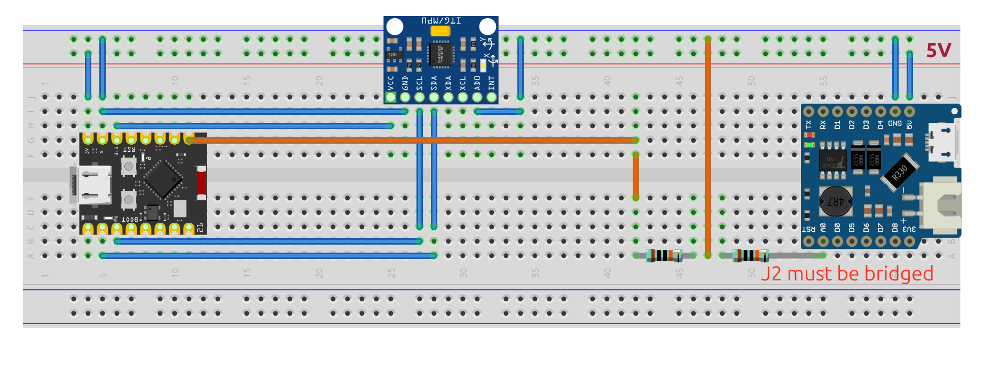

# bikesensor

Geo-tagged bike vibration analysis. ESP32 + MPU-6050 over BLE, GPX from phone,
short-time FFTs aligned to ~2 m of road via clock-model + GPS interpolation.

## Hardware

- ESP32-C3 SuperMini + MPU-6050 over I²C (SDA=GPIO 6, SCL=GPIO 7, AD0→GND).
  Avoid GPIO 8 (onboard LED) and GPIO 9 (BOOT button).
- Hardware includes a battery voltage divider connected to an analog pin (GPIO 0) to monitor battery percentage.
- iOS/Android phone running [LightBlue](https://punchthrough.com/lightblue/) for BLE log capture.
- Phone records a GPX track in parallel (any GPX recorder app).

## Wire protocol

Service `0xFFE0`, characteristic `0xFFE1` (notify). Two packet types,
distinguished by first byte:

| Type | Bytes | Layout |
| --- | --- | --- |
| SYNC `0xA5` | 9 | `[0xA5][u32 sample_idx LE][u16 fs LE][u8 n_axes][u8 battery_percent]` |
| DATA `0x5A` | 6+12·N | `[0x5A][u32 first_sample_idx LE][u8 N][N × 6 × int16 BE]` |

IMU bytes are forwarded raw from the MPU-6050 FIFO (big-endian).
Defaults: fs = 250 Hz, N = 10 samples/packet, ±4 g, ±500 °/s.


## Spatial-accuracy strategy

1. **Sample timestamps** come from a linear fit `t_phone = a + b·sample_idx`
   over all SYNC packets — kills BLE jitter (~50–200 ms) and absorbs the
   ESP32-vs-phone clock offset.
2. **Position per FFT window** is **interpolated** from the 1 Hz GPX track
   onto each window's center timestamp — sub-meter along-track at constant
   speed, even though absolute lat/lon is bounded by phone-GPS noise (3–5 m).
3. **STFT** with 0.5 s Hann window, 0.1 s hop → 0.5 m hop spacing at 5 m/s.

## Firmware (PlatformIO)

```bash
pio run -d firmware              # build
pio run -d firmware -t upload    # flash
pio device monitor -b 115200     # serial debug
```

Source lives in `firmware/bikesensor/bikesensor.ino`; `firmware/platformio.ini`
points at it via `src_dir = bikesensor`.

## Pipeline & Dashboard

The primary way to process and visualize data is through the interactive Streamlit dashboard.

```bash
# 1. Flash the firmware (above).
# 2. Record a ride: GPX on phone, LightBlue logging characteristic 0xFFE1.
# 3. Export LightBlue log as CSV or TXT. Save GPX.
# 4. Launch the dashboard:

uv run streamlit run src/dashboard.py
```

Inside the dashboard:
1. Upload your recorded `.gpx` tracks and `.csv`/`.txt` LightBlue logs using the sidebar file uploader.
2. The pipeline will automatically merge the files, calculate STFT features (like `max_bump_g` and frequency bands), and extract battery metrics.
3. Processed data is saved to `data/imu.csv`, `data/windows.csv`, and `data/track.csv` for fast reloading.

The dashboard features:
- **Map Analysis:** An interactive heatmap and clickable route. Click any point to view local time-domain and frequency-domain vibration details.
- **Route Overview:** Charts detailing vibration intensity (`max_bump_g`, `rms_g`, frequency bands) and speed over the cumulative distance of the ride.
- **Key Metrics:** Ride duration, total distance, average speed, and battery consumption tracking.
