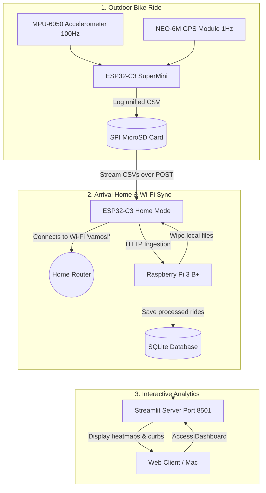

# bikesensor 🚲📡

**A standalone, low-cost, pure IoT hardware and software mapping pipeline for geo-tagged bike vibration and road-quality analysis.**

`bikesensor` turns an ESP32-C3 SuperMini, an MPU-6050 IMU, a NEO-6M GPS, and an SPI MicroSD card module into a standalone, battery-powered mapping box. 

When you ride, the device autonomously records high-frequency (100 Hz) vertical accelerometer vibrations and sparse (1 Hz) GPS coordinate ticks into unified local CSV log files on the SD card. When you return home, the device automatically connects to your home Wi-Fi, uploads all offline ride CSVs in a fast burst to a local 24/7 Raspberry Pi homeserver running a FastAPI server, wipes the SD card, and goes back to sleep.

The backend automatically runs linear interpolation, Butterworth filtering, and Short-Time Fourier Transforms (STFT) to map road surface roughness (PSD heatmaps) and flag curb shocks in an interactive Streamlit dashboard.

---

## 1. System Architecture



---

## 2. Hardware Wiring (ESP32-C3 SuperMini)

The hardware operates strictly on **3.3V logic**, but the GPS module's VCC is powered by the ESP32 **5V** pin to ensure the onboard 3.3V regulator boots the GPS chip reliably:

| Peripheral | Connection | ESP32-C3 SuperMini Pin | Notes |
| :--- | :--- | :--- | :--- |
| **MPU-6050 (I2C)** | SDA | **GPIO 6** | Shared I2C Bus |
| | SCL | **GPIO 7** | Shared I2C Bus |
| **MicroSD (SPI)** | CS | **GPIO 2** | Chip Select |
| | MOSI | **GPIO 3** | SPI Master Out |
| | SCK | **GPIO 4** | SPI Clock |
| | MISO | **GPIO 5** | SPI Master In |
| **NEO-6M (UART1)** | TX | **GPIO 10** | Connects to ESP32 RX |
| | RX | **GPIO 1** | Connects to ESP32 TX |
| | VCC | **5V Pin** | Stepped down to 3.3V on-board |
| | GND | **GND** | Shared Ground reference |

---

## 3. Firmwares (PlatformIO)

The firmware resides in `firmware/bikesensor/bikesensor.ino` and compiles out-of-the-box.

### Secure Credentials (Git-Ignored)
To protect your home Wi-Fi passwords from being committed to Git, create a file named `private_credentials.h` inside `firmware/bikesensor/`:
```cpp
#pragma once
#define WIFI_SSID "YourHomeSSID"
#define WIFI_PASS "YourHomePassword"
```
The firmware preprocessor will automatically detect and include this file during compile, keeping your passwords safe and isolated in your local workspace.

### Compilation Commands:
```bash
pio run -d firmware              # Build firmware binary
pio run -d firmware -t upload    # Flash to ESP32-C3 (Serial port is auto-detected)
pio device monitor -b 115200     # Real-time console debugger
```

---

## 4. Raspberry Pi Server Deployment (Systemd)

Both the ingestion server and the Streamlit dashboard run 24/7 in the background on your Raspberry Pi homeserver (`bikesensor-server.local`, IP: `192.168.0.71`), managed by Linux `systemd` to ensure they automatically start on boot and recover from power cutoffs.

### Systemd Control Commands:
```bash
# Check the real-time status of the servers
sudo systemctl status bikesensor-api.service
sudo systemctl status bikesensor-dashboard.service

# Restart the services
sudo systemctl restart bikesensor-api.service
sudo systemctl restart bikesensor-dashboard.service

# Read the last 50 lines of background execution logs
sudo journalctl -u bikesensor-api.service -n 50 -f
```

---

## 5. Local Network Endpoints

Once the servers are running on your homeserver, they are accessible from any device on your local Wi-Fi:

* 📊 **Interactive Web Dashboard:** [http://192.168.0.71:8501](http://192.168.0.71:8501)
  * Displays multi-ride GPS heatmaps of road surface roughness.
  * Details vertical curb-shock warnings, average ride statistics, and PSD frequency spectrum graphs.
* 🔌 **FastAPI Ingestion Endpoint:** `http://192.168.0.71:8000/api/upload-offline`
  * Accepts raw CSV POST requests directly from the ESP32 wireless logging box.
  * Automatically parses GPS/IMU fields, interpolates timestamps, runs STFT, and registers in `data/rides.db` (SQLite).
