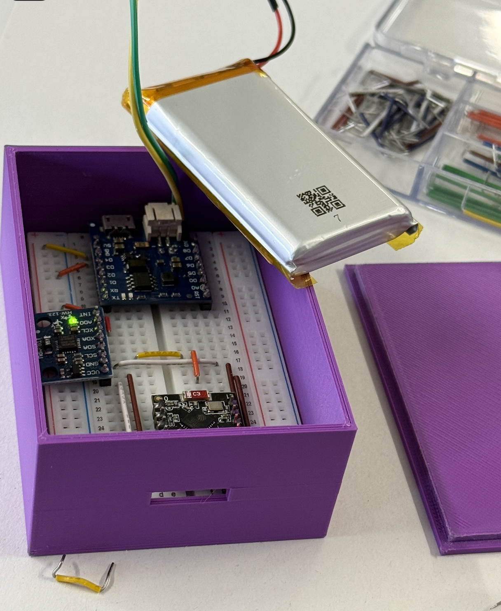
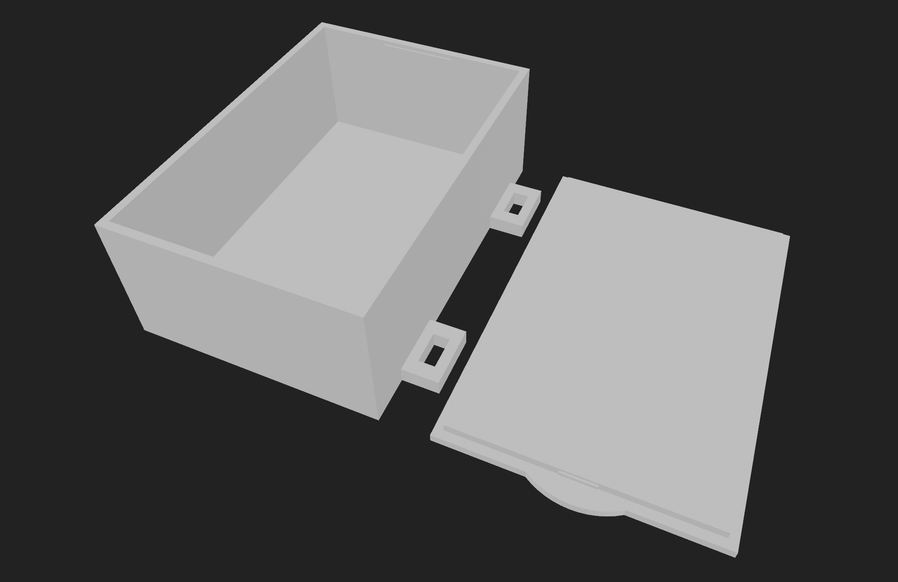
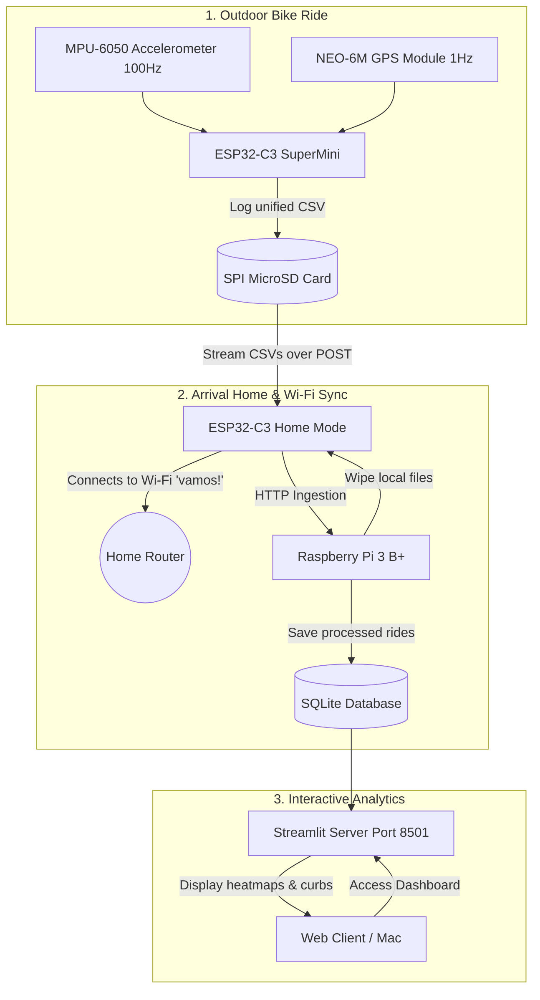
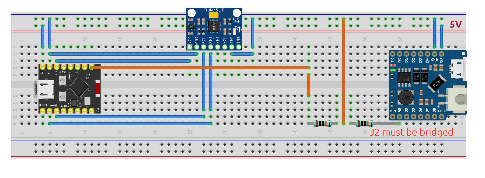

# bikesensor 🚲📡

**A standalone, low-cost, pure IoT hardware and software mapping pipeline for geo-tagged bike vibration and road-quality analysis.**

`bikesensor` turns an ESP32-C3 SuperMini, an MPU-6050 IMU, a NEO-6M GPS, and an SPI MicroSD card module into a standalone, battery-powered mapping box. 

When you ride, the device autonomously records high-frequency (100 Hz) vertical accelerometer vibrations and sparse (1 Hz) GPS coordinate ticks into unified local CSV log files on the SD card. When you return home, the device automatically connects to your home Wi-Fi, uploads all offline ride CSVs in a fast burst to a local 24/7 Raspberry Pi homeserver running a FastAPI server, wipes the SD card, and goes back to sleep.

The backend automatically runs linear interpolation, Butterworth filtering, and Short-Time Fourier Transforms (STFT) to map road surface roughness (PSD heatmaps) and flag curb shocks in an interactive Streamlit dashboard.

---

## 📸 Hardware Showcase

Below is the completed physical system mounted on a custom 3D-printed handlebar enclosure and its 3D modeling design:

| Physical System | 3D Printed Enclosure Design |
| :---: | :---: |
|  |  |

---

## 1. System Architecture


```mermaid
flowchart TD
    subgraph Riding [1. Outdoor Bike Ride]
        ESP[ESP32-C3 SuperMini]
        IMU[MPU-6050 Accelerometer 100Hz] --> ESP
        GPS[NEO-6M GPS Module 1Hz] --> ESP
        ESP -->|Log unified CSV| SD[(SPI MicroSD Card)]
    end

    subgraph Home [2. Arrival Home & Wi-Fi Sync]
        ESP_H[ESP32-C3 Home Mode] -->|Connects to Wi-Fi 'vamos!'| Router((Home Router))
        SD -->|Stream CSVs over POST| ESP_H
        ESP_H -->|HTTP Ingestion| Pi[Raspberry Pi 3 B+]
        Pi -->|Save processed rides| DB[(SQLite Database)]
        Pi -->|Wipe local files| ESP_H
    end

    subgraph Analytics [3. Interactive Analytics]
        Browser[Web Client / Mac] -->|Access Dashboard| Web[Streamlit Server Port 8501]
        DB --> Web
        Web -->|Display heatmaps & curbs| Browser
    end
```

---

## 2. Hardware Wiring & Custom PCB Carrier

The hardware operates on **3.3V logic** for standard communication and SD logging, driven by a Wemos D1 Mini TP5400 Battery Shield. 

Here is the physical wiring diagram for our custom carrier board:



### Pin Map Table:

| Peripheral | Connection | Pin | Notes |
| :--- | :--- | :--- | :--- |
| **MPU-6050 (I2C)** | SDA | **GPIO 6** | Shared I2C Bus |
| | SCL | **GPIO 7** | Shared I2C Bus |
| | VCC / GND | **3V3 / GND** | Powered by system 3.3V rail |
| **MicroSD (SPI)** | CS | **GPIO 2** | Chip Select |
| | MOSI | **GPIO 3** | SPI Master Out |
| | SCK | **GPIO 4** | SPI Clock |
| | MISO | **GPIO 5** | SPI Master In |
| | VCC / GND | **3V3 / GND** | Powered by system 3.3V rail |
| **NEO-6M (UART1)** | TX | **GPIO 10** | Connects to ESP32 RX |
| | RX | **GPIO 1** | Connects to ESP32 TX |
| | VCC / GND | **5V / GND** | Powered by 5V boost output |
| **Wemos Battery Shield** | 5V Out | **J7 Pin 8** | Boosted 5.0V output |
| | GND | **J7 Pin 7** | System Ground |
| **SPDT Slide Switch (SW1)** | In / Out | **In Series** | Connected between `J7 Pin 8` (5V out) and `5V` net (ESP32 5V pin). Completely cuts off system power while preserving USB charging. |
| **Voltage Divider (R1, R2, C3)** | Junction | **GPIO 0** | **R1 (100kΩ)** and **R2 (100kΩ)** divide raw battery voltage in half (`4.2V -> 2.1V`) for safe ADC reading. **C3 (100nF)** in parallel with R2 filters noise. |
| **Decoupling Caps (C1, C2)** | Parallel | **3V3 / GND** | **C1 (10µF radial)** and **C2 (100nF ceramic)** placed in parallel next to the MicroSD socket prevent write-cycle voltage sags. |

---

## 3. Firmwares (PlatformIO)

The firmware resides in `firmware/bikesensor/bikesensor.ino` and compiles out-of-the-box.

### Secure Credentials (Git-Ignored)
To protect your home Wi-Fi passwords from being committed to Git, create a file named `private_credentials.h` inside `firmware/bikesensor/`:
```cpp
#pragma once
#define WIFI_SSID "YourHomeSSID"
#define WIFI_PASS "YourHomePassword"
#define SERVER_HOST "bikesensor-server.local"  // preferred: mDNS host
#define SERVER_PORT 8000
#define SERVER_UPLOAD_PATH "/api/upload-offline"
```
The firmware preprocessor will automatically detect and include this file during compile, keeping your passwords safe and isolated in your local workspace.

### Compilation Commands:
```bash
pio run -d firmware              # Build firmware binary
pio run -d firmware -t upload    # Flash to ESP32-C3 (Serial port is auto-detected)
pio device monitor -b 115200     # Real-time console debugger
```

---

## 4. Raspberry Pi Server Deployment (Systemd)

Both the ingestion server and the Streamlit dashboard run 24/7 in the background on your Raspberry Pi homeserver (`bikesensor-server.local`, current IP: `192.168.0.72`), managed by Linux `systemd` to ensure they automatically start on boot and recover from power cutoffs.

### Production Start Commands (no autoreload)
Use these in your `ExecStart` definitions (or equivalent shell scripts):
```bash
uv run uvicorn src.server:app --host 0.0.0.0 --port 8000
uv run streamlit run src/dashboard.py --server.port 8501 --server.address 0.0.0.0
```

### Systemd Control Commands:
```bash
# Check the real-time status of the servers
sudo systemctl status bikesensor-api.service
sudo systemctl status bikesensor-dashboard.service

# Restart the services
sudo systemctl restart bikesensor-api.service
sudo systemctl restart bikesensor-dashboard.service

# Read the last 50 lines of background execution logs
sudo journalctl -u bikesensor-api.service -n 50 -f
```

---

## 5. Native macOS Sync Notifications (SSH Hook)

To make ride syncing completely frictionless, the Pi homeserver is integrated with a local-only, secure SSH hook that immediately triggers a native macOS notification on your MacBook screen (`Josts-MacBook-Air.local`) upon successful processing.

* **Frictionless Feedback:** As soon as you come home and your ESP32 uploads its files, your Mac slides out a notification chimes (**Glass** sound) notifying you of your synced distance, duration, and processed metrics.
* **100% Secure & Local:** Communication operates passwordlessly using custom pre-authorized SSH keys (`~/.ssh/authorized_keys`) and standard macOS Remote Login. It fails gracefully (silently in background logs) if your Mac is away or offline, completely preserving system isolation.

---

## 6. Local Network Endpoints

Once the servers are running on your homeserver, they are accessible from any device on your local Wi-Fi:

* 📊 **Interactive Web Dashboard:** [http://bikesensor-server.local:8501](http://bikesensor-server.local:8501)
  * Displays multi-ride GPS heatmaps of road surface roughness.
  * Details vertical curb-shock warnings, average ride statistics, and PSD frequency spectrum graphs.
* 🔌 **FastAPI Ingestion Endpoint:** `http://bikesensor-server.local:8000/api/upload-offline`
  * Accepts raw CSV POST requests directly from the ESP32 wireless logging box.
  * Automatically parses GPS/IMU fields, interpolates timestamps, runs STFT, and registers in `data/rides.db` (SQLite).
* ❤️ **API Health Endpoint:** `http://bikesensor-server.local:8000/health`
  * Returns quick service/DB liveness status for monitoring.

---

## 7. Device-to-Server Interfacing

The communication between the hardware logging box and the backend server operates over a lightweight, wireless HTTP API.

### 7.1 CSV Log Data Format
When writing to the MicroSD card, the device registers data in a unified, comma-separated format:
```csv
millis,ax,ay,az,lat,lon,ele,speed_kmh,battery_pct,gps_time
```
*   `millis`: Relative milliseconds from ESP32 boot (used to align high-frequency vibration data).
*   `ax,ay,az`: Raw vertical/lateral/longitudinal accelerometer values (scaled inside the DSP pipeline).
*   `lat,lon,ele,speed_kmh`: GPS coordinate details.
*   `battery_pct`: Divided battery measurement (`0 - 100%`) read from `GPIO 0`.
*   `gps_time`: GPS UTC timestamp (used as a clock reference).

### 7.2 Wireless Sync Protocol
When the ESP32-C3 boots in Wi-Fi sync mode upon returning home, it scans the local storage, reads the log files, and performs an HTTP POST request:

*   **HTTP Method:** `POST`
*   **Request URL:** `http://bikesensor-server.local:8000/api/upload-offline`
*   **Request Header:** `X-Ride-Filename: <filename>` (e.g., `ride_001.csv`)
*   **Request Body:** Raw CSV file text content (UTF-8 encoded).

### 7.3 Ingestion Processing Modes
When the FastAPI server receives the upload:
1.  **Unified Mode (Fully Automated):** If the CSV headers contain `lat` and `lon` fields, the server immediately triggers the DSP pipeline in a background thread. It runs GPS linear interpolation, Butterworth filtering, and STFT, saves the processed segments to the SQLite database (`data/rides.db`), and fires a macOS notification.
2.  **Pending Mode (Manual GPX Merge):** If GPS coordinate fields are missing or incomplete in the raw log, the server stores the CSV in `data/pending/`. A prompt appears in the Streamlit dashboard sidebar, letting you upload a standard GPX file exported from any standard phone app. The dashboard builds a relative-millisecond clock model, aligns and merges the datasets, runs the analysis, and updates the database.
