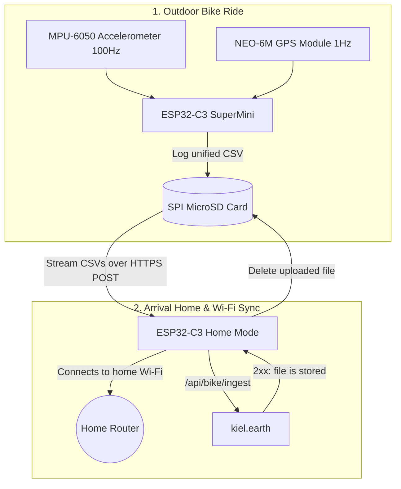
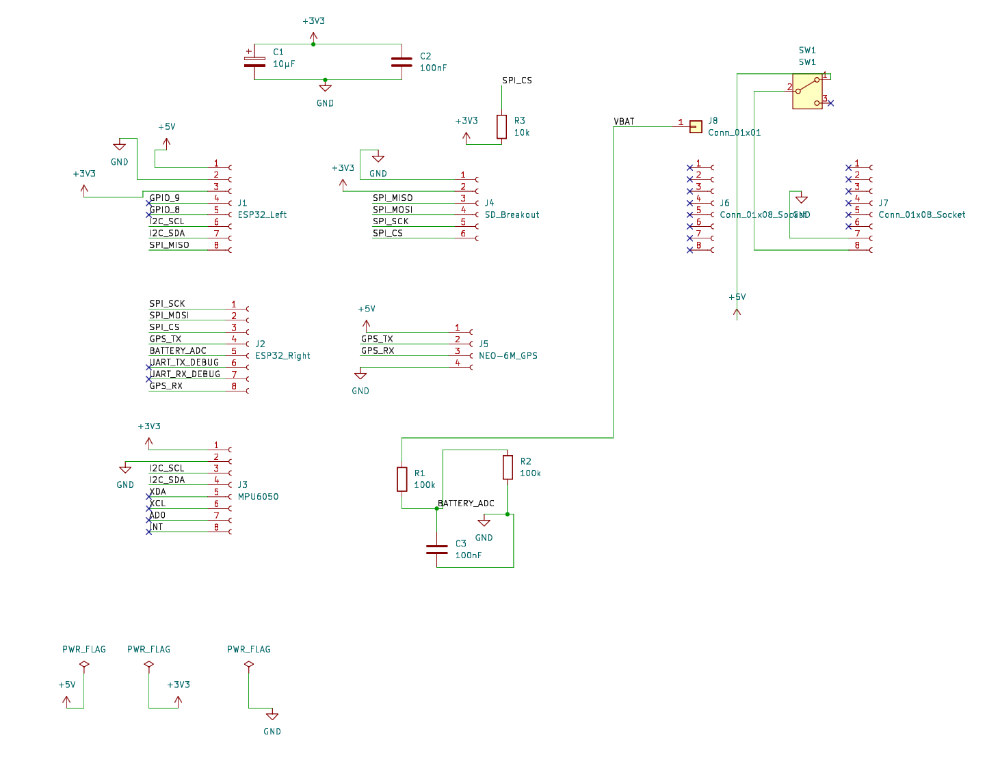
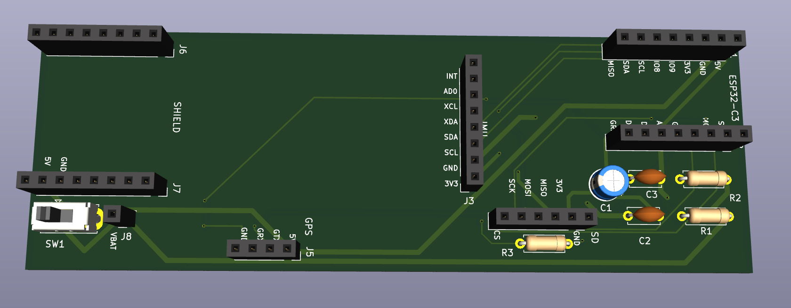

# bikesensor 🚲📡

**A standalone, low-cost, pure IoT hardware and software mapping pipeline for geo-tagged bike vibration and road-quality analysis.**

`bikesensor` turns an ESP32-C3 SuperMini, an MPU-6050 IMU, a NEO-6M GPS, and an SPI MicroSD card module into a standalone, battery-powered mapping box. 

When you ride, the device autonomously records high-frequency (200 Hz) vertical accelerometer vibrations and sparse (1 Hz) GPS coordinate ticks into unified local CSV log files on the SD card. When you return home, the device connects to your home Wi-Fi and uploads all offline ride CSVs over HTTPS to [kiel.earth](https://kiel.earth), where the rides are stored, processed and mapped. That website lives in its own repository; this one holds the firmware, the carrier PCB and the enclosure.

---

## ⚠️ Project status

* **The custom PCB has been re-laid-out** to 38.74 × 114.47 mm and re-plotted. `production/bikesensor.zip` matches the current design and passes DRC with zero errors and zero unconnected pads. It has **not been fabricated or assembled yet**, so nothing about it is bench-proven — the header-pin-to-GPIO mapping in particular is still unverified, see `custom_pcb/PIN_VERIFICATION.md`.
* **The hardware has never produced a real ride.** Every figure produced so far comes from synthetic signals.

---

## 📸 Hardware Showcase

Below is the completed physical system mounted on a custom 3D-printed handlebar enclosure and its 3D modeling design:

| Physical System | 3D Printed Enclosure Design |
| :---: | :---: |
|  |  |

---

## 1. System Architecture


```mermaid
flowchart TD
    subgraph Riding [1. Outdoor Bike Ride]
        ESP[ESP32-C3 SuperMini]
        IMU[MPU-6050 Accelerometer 100Hz] --> ESP
        GPS[NEO-6M GPS Module 1Hz] --> ESP
        ESP -->|Log unified CSV| SD[(SPI MicroSD Card)]
    end

    subgraph Home [2. Arrival Home & Wi-Fi Sync]
        ESP_H[ESP32-C3 Home Mode] -->|Connects to home Wi-Fi| Router((Home Router))
        SD -->|Stream CSVs over HTTPS POST| ESP_H
        ESP_H -->|/api/bike/ingest| Site[kiel.earth]
        Site -->|2xx: file is stored| ESP_H
        ESP_H -->|Delete uploaded file| SD
    end
```

---

## 2. Hardware Wiring & Custom PCB Carrier

The hardware operates on **3.3V logic** for standard communication and SD logging, driven by a Wemos D1 Mini TP5400 Battery Shield. 

Here is the physical wiring diagram for our custom carrier board:


### Schematic

R3 (10 kΩ) pulls `SPI_CS` to `+3V3`. GPIO2 is an ESP32-C3 strapping pin and must be high or floating at reset; many MicroSD modules hold CS low at power-up, which can stop the chip booting.



### Board

The carrier is 38.74 × 114.47 mm, 2-layer, all through-hole. Every connected pin carries a silkscreen signal name — `GTX`/`GRX` are the GPS UART, `DTX`/`DRX` the debug UART, and `ADC` the battery divider.



### Pin Map Table:

| Peripheral | Connection | Pin | Notes |
| :--- | :--- | :--- | :--- |
| **MPU-6050 (I2C)** | SDA | **GPIO 6** | Shared I2C Bus |
| | SCL | **GPIO 7** | Shared I2C Bus |
| | VCC / GND | **3V3 / GND** | Powered by system 3.3V rail |
| **MicroSD (SPI)** | CS | **GPIO 2** | Chip Select |
| | MOSI | **GPIO 3** | SPI Master Out |
| | SCK | **GPIO 4** | SPI Clock |
| | MISO | **GPIO 5** | SPI Master In |
| | VCC / GND | **3V3 / GND** | Powered by system 3.3V rail |
| **NEO-6M (UART1)** | TX | **GPIO 10** | Connects to ESP32 RX |
| | RX | **GPIO 1** | Connects to ESP32 TX |
| | VCC / GND | **5V / GND** | Powered by 5V boost output |
| **Wemos Battery Shield** | 5V Out | **J7 Pin 8** | Boosted 5.0V output |
| | GND | **J7 Pin 7** | System Ground |
| **SPDT Slide Switch (SW1)** | In / Out | **In Series** | Connected between `J7 Pin 8` (5V out) and `5V` net (ESP32 5V pin). Completely cuts off system power while preserving USB charging. |
| **Voltage Divider (R1, R2, C3)** | Junction | **GPIO 0** | **R1 (100kΩ)** and **R2 (100kΩ)** divide raw battery voltage in half (`4.2V -> 2.1V`) for safe ADC reading. **C3 (100nF)** in parallel with R2 filters noise. |
| **Decoupling Caps (C1, C2)** | Parallel | **3V3 / GND** | **C1 (10µF radial)** and **C2 (100nF ceramic)** placed in parallel next to the MicroSD socket prevent write-cycle voltage sags. |

---

## 3. Firmwares (PlatformIO)

The firmware resides in `firmware/bikesensor/bikesensor.ino` and compiles out-of-the-box.

### Secure Credentials (Git-Ignored)
To protect your home Wi-Fi passwords from being committed to Git, create a file named `private_credentials.h` inside `firmware/bikesensor/`:
```cpp
#pragma once
#define WIFI_SSID "YourHomeSSID"
#define WIFI_PASS "YourHomePassword"
#define SERVER_HOST "kiel.earth"
#define SERVER_PORT 443
#define SERVER_UPLOAD_PATH "/api/bike/ingest"
#define DEVICE_TOKEN "your-device-token"   // sent as: Authorization: Bearer <token>
```
The firmware preprocessor will automatically detect and include this file during compile, keeping your passwords safe and isolated in your local workspace.

### Compilation Commands:
```bash
pio run -d firmware              # Build firmware binary
pio run -d firmware -t upload    # Flash to ESP32-C3 (Serial port is auto-detected)
pio device monitor -b 115200     # Real-time console debugger
```

---

## 4. Device-to-Server Interface

The logging box talks to the website over a single HTTPS endpoint.

### 4.1 CSV Log Data Format
When writing to the MicroSD card, the device registers data in a unified, comma-separated format:
```csv
millis,ax,ay,az,lat,lon,ele,speed_kmh,battery_pct,gps_time
```
*   `millis`: Relative milliseconds from ESP32 boot (used to align high-frequency vibration data).
*   `ax,ay,az`: Raw vertical/lateral/longitudinal accelerometer values (the ±4 g scale, `1/8192`, is applied on the website, not on the device).
*   `lat,lon,ele,speed_kmh`: GPS coordinate details.
*   `battery_pct`: Divided battery measurement (`0 - 100%`) read from `GPIO 0`.
*   `gps_time`: GPS UTC timestamp (used as a clock reference).

### 4.2 Wireless Sync Protocol
When the ESP32-C3 boots in Wi-Fi sync mode upon returning home, it uploads every ride file on the SD card, one HTTPS request each:

*   **HTTP Method:** `POST`
*   **Request URL:** `https://kiel.earth/api/bike/ingest` (set by `SERVER_HOST` / `SERVER_UPLOAD_PATH`)
*   **Request Headers:** `Content-Type: text/csv`, `Authorization: Bearer <DEVICE_TOKEN>`, `X-Ride-Id: <filename without .csv>`
*   **Request Body:** the raw CSV file.

The device deletes a file from the SD card only after a 2xx response. On a timeout, TLS failure or any other status it keeps the file and retries on the next sync.
