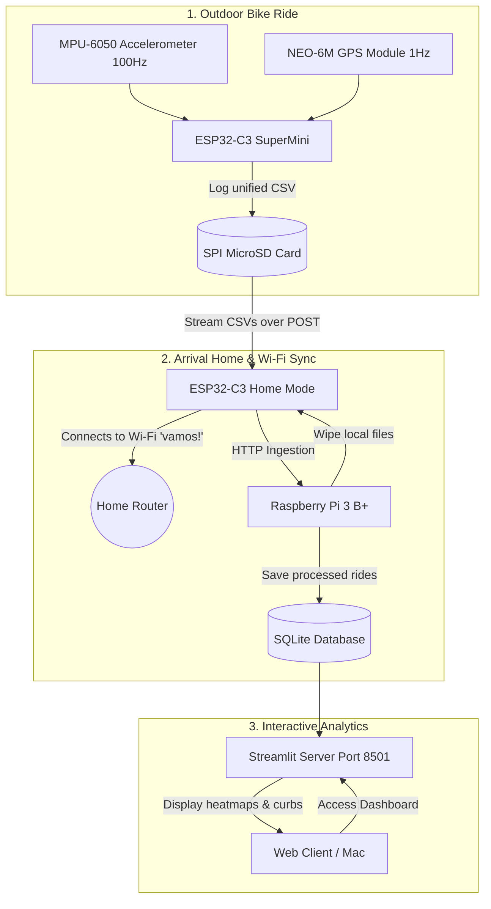

# bikesensor 🚲📡

**A standalone, low-cost, pure IoT hardware and software mapping pipeline for geo-tagged bike vibration and road-quality analysis.**

`bikesensor` turns an ESP32-C3 SuperMini, an MPU-6050 IMU, a NEO-6M GPS, and an SPI MicroSD card module into a standalone, battery-powered mapping box. 

When you ride, the device autonomously records high-frequency (200 Hz) vertical accelerometer vibrations and sparse (1 Hz) GPS coordinate ticks into unified local CSV log files on the SD card. When you return home, the device connects to your home Wi-Fi and uploads all offline ride CSVs over HTTPS.

The pipeline runs linear interpolation, Butterworth filtering, and Short-Time Fourier Transforms (STFT) to map road surface roughness (PSD heatmaps) and flag curb shocks.

---

## ⚠️ Project status

This README documents the **original Raspberry Pi architecture**, which is being retired. Read §3–§7 with that in mind:

* **The firmware no longer uploads to the Pi.** It posts to `https://kiel.earth` over TLS. The FastAPI server and Streamlit dashboard in `src/` still run and remain the reference DSP implementation, but they are no longer the device's upload target.
* **The custom PCB has been ordered** (38.74 × 114.47 mm, `production/bikesensor.zip`) but not assembled. Its ESP32 headers were routed against the wrong SuperMini pinout, so every signal lands on a different GPIO than the hand-wired prototype used. The default firmware build is remapped to match the board; the battery sense needs one bodge wire during assembly. Details in `custom_pcb/PIN_VERIFICATION.md`.
* **The hardware has never produced a real ride.** Every figure produced so far comes from synthetic signals.

---

## 📸 Hardware Showcase

Below is the completed physical system mounted on a custom 3D-printed handlebar enclosure and its 3D modeling design:

| Physical System | 3D Printed Enclosure Design |
| :---: | :---: |
|  |  |

---

## 1. System Architecture


```mermaid
flowchart TD
    subgraph Riding [1. Outdoor Bike Ride]
        ESP[ESP32-C3 SuperMini]
        IMU[MPU-6050 Accelerometer 100Hz] --> ESP
        GPS[NEO-6M GPS Module 1Hz] --> ESP
        ESP -->|Log unified CSV| SD[(SPI MicroSD Card)]
    end

    subgraph Home [2. Arrival Home & Wi-Fi Sync]
        ESP_H[ESP32-C3 Home Mode] -->|Connects to Wi-Fi 'vamos!'| Router((Home Router))
        SD -->|Stream CSVs over POST| ESP_H
        ESP_H -->|HTTP Ingestion| Pi[Raspberry Pi 3 B+]
        Pi -->|Save processed rides| DB[(SQLite Database)]
        Pi -->|Wipe local files| ESP_H
    end

    subgraph Analytics [3. Interactive Analytics]
        Browser[Web Client / Mac] -->|Access Dashboard| Web[Streamlit Server Port 8501]
        DB --> Web
        Web -->|Display heatmaps & curbs| Browser
    end
```

---

## 2. Hardware Wiring & Custom PCB Carrier

The hardware operates on **3.3V logic** for standard communication and SD logging, driven by a Wemos D1 Mini TP5400 Battery Shield. 

Here is the physical wiring diagram for our custom carrier board:


### Schematic

R3 (10 kΩ) pulls `SPI_CS` to `+3V3`, keeping the card deselected while the ESP32 boots. The schematic's ESP32 connectors are generic sockets, so it does not show which GPIO each net reaches; the table below does.


### Board

The carrier is 38.74 × 114.47 mm, 2-layer, all through-hole. Every connected pin carries a silkscreen signal name — `GTX`/`GRX` are the GPS UART, `DTX`/`DRX` the debug UART, and `ADC` the battery divider.


### Pin Map Table:

GPIOs are for the carrier PCB (default firmware build). The hand-wired prototype used different ones — `pio run -d firmware -e handwired`.

| Peripheral | Connection | Pin | Notes |
| :--- | :--- | :--- | :--- |
| **MPU-6050 (I2C)** | SDA | **GPIO 1** | J1.7, shared I2C bus |
| | SCL | **GPIO 2** | J1.6. Strapping pin, held high by the GY-521's pull-ups |
| | VCC / GND | **3V3 / GND** | Powered by system 3.3V rail |
| **MicroSD (SPI)** | CS | **GPIO 7** | J2.3, R3 pull-up |
| | MOSI | **GPIO 6** | J2.2 |
| | SCK | **GPIO 5** | J2.1 |
| | MISO | **GPIO 0** | J1.8 |
| | VCC / GND | **3V3 / GND** | Powered by system 3.3V rail |
| **NEO-6M (UART1)** | TX / RX | **GPIO 8 / GPIO 21** | J2.4 / J2.8. Firmware detects which one the GPS transmits on |
| | VCC / GND | **5V / GND** | Powered by 5V boost output |
| **Wemos Battery Shield** | 5V Out | **J7 Pin 8** | Boosted 5.0V output |
| | GND | **J7 Pin 7** | System Ground |
| **SPDT Slide Switch (SW1)** | In / Out | **In Series** | Connected between `J7 Pin 8` (5V out) and `5V` net (ESP32 5V pin). Completely cuts off system power while preserving USB charging. |
| **Voltage Divider (R1, R2, C3)** | Junction | **GPIO 3** | Routed to J2.5 = GPIO 9, which has no ADC; reaches GPIO 3 only via the bodge wire in `PIN_VERIFICATION.md`. **R1 (100kΩ)** and **R2 (100kΩ)** divide raw battery voltage in half (`4.2V -> 2.1V`) for safe ADC reading. **C3 (100nF)** in parallel with R2 filters noise. |
| **Decoupling Caps (C1, C2)** | Parallel | **3V3 / GND** | **C1 (47µF radial; 10µF fits but is marginal)** and **C2 (100nF ceramic)** placed in parallel next to the MicroSD socket prevent write-cycle voltage sags. |

---

## 3. Firmwares (PlatformIO)

The firmware resides in `firmware/bikesensor/bikesensor.ino` and compiles out-of-the-box.

### Secure Credentials (Git-Ignored)
To protect your home Wi-Fi passwords from being committed to Git, create a file named `private_credentials.h` inside `firmware/bikesensor/`:
```cpp
#pragma once
#define WIFI_SSID "YourHomeSSID"
#define WIFI_PASS "YourHomePassword"
#define SERVER_HOST "kiel.earth"
#define SERVER_PORT 443
#define SERVER_UPLOAD_PATH "/api/bike/ingest"
#define DEVICE_TOKEN "your-device-token"   // sent as: Authorization: Bearer <token>
```
The firmware preprocessor will automatically detect and include this file during compile, keeping your passwords safe and isolated in your local workspace.

### Compilation Commands:
```bash
pio run -d firmware              # Build firmware binary
pio run -d firmware -t upload    # Flash to ESP32-C3 (Serial port is auto-detected)
pio device monitor -b 115200     # Real-time console debugger
```

---

## 4. Raspberry Pi Server Deployment (Systemd) — *legacy*

> Superseded by the `kiel.earth` backend; kept because `src/` still runs this way locally.

Both the ingestion server and the Streamlit dashboard run in the background on the Raspberry Pi homeserver, managed by Linux `systemd` so they start on boot and recover from power cuts.

### Production Start Commands (no autoreload)
Use these in your `ExecStart` definitions (or equivalent shell scripts):
```bash
uv run uvicorn src.server:app --host 0.0.0.0 --port 8000
uv run streamlit run src/dashboard.py --server.port 8501 --server.address 0.0.0.0
```

### Systemd Control Commands:
```bash
# Check the real-time status of the servers
sudo systemctl status bikesensor-api.service
sudo systemctl status bikesensor-dashboard.service

# Restart the services
sudo systemctl restart bikesensor-api.service
sudo systemctl restart bikesensor-dashboard.service

# Read the last 50 lines of background execution logs
sudo journalctl -u bikesensor-api.service -n 50 -f
```

---

## 5. Native macOS Sync Notifications — *removed*

This feature was deleted from the server for privacy and security reasons (commits `3e252cc`, `a728063`). The server no longer performs any outbound notification, SSH call, or audio playback on upload. The section is kept as a marker so the numbering below stays stable; see git history if you want the old implementation.

---

## 6. Local Network Endpoints — *legacy*

When the legacy servers are running, they are reachable from any device on the same Wi-Fi:

* 📊 **Interactive Web Dashboard:** [http://bikesensor-server.local:8501](http://bikesensor-server.local:8501)
  * Displays multi-ride GPS heatmaps of road surface roughness.
  * Details vertical curb-shock warnings, average ride statistics, and PSD frequency spectrum graphs.
* 🔌 **FastAPI Ingestion Endpoint:** `http://bikesensor-server.local:8000/api/upload-offline`
  * Accepts raw CSV POST requests directly from the ESP32 wireless logging box.
  * Automatically parses GPS/IMU fields, interpolates timestamps, runs STFT, and registers in `data/rides.db` (SQLite).
* ❤️ **API Health Endpoint:** `http://bikesensor-server.local:8000/health`
  * Returns quick service/DB liveness status for monitoring.

---

## 7. Device-to-Server Interfacing

The communication between the hardware logging box and the backend server operates over a lightweight, wireless HTTP API.

### 7.1 CSV Log Data Format
When writing to the MicroSD card, the device registers data in a unified, comma-separated format:
```csv
millis,ax,ay,az,lat,lon,ele,speed_kmh,battery_pct,gps_time
```
*   `millis`: Relative milliseconds from ESP32 boot (used to align high-frequency vibration data).
*   `ax,ay,az`: Raw vertical/lateral/longitudinal accelerometer values (scaled inside the DSP pipeline).
*   `lat,lon,ele,speed_kmh`: GPS coordinate details.
*   `battery_pct`: Divided battery measurement (`0 - 100%`) read from `GPIO 3` on the carrier PCB (`GPIO 0` on the hand-wired prototype).
*   `gps_time`: GPS UTC timestamp (used as a clock reference).

### 7.2 Wireless Sync Protocol
When the ESP32-C3 boots in Wi-Fi sync mode upon returning home, it scans the local storage, reads the log files, and performs an HTTP POST request:

*   **HTTP Method:** `POST`
*   **Request URL:** `http://bikesensor-server.local:8000/api/upload-offline`
*   **Request Header:** `X-Ride-Filename: <filename>` (e.g., `ride_001.csv`)
*   **Request Body:** Raw CSV file text content (UTF-8 encoded).

### 7.3 Ingestion Processing Modes
When the FastAPI server receives the upload:
1.  **Unified Mode (Fully Automated):** If the CSV headers contain `lat` and `lon` fields, the server immediately triggers the DSP pipeline in a background thread. It runs GPS linear interpolation, Butterworth filtering, and STFT, and saves the processed segments to the SQLite database (`data/rides.db`). A log with fewer than two GPS fixes is **rejected** rather than given fallback coordinates.
2.  **Pending Mode (Manual GPX Merge):** If GPS coordinate fields are missing or incomplete in the raw log, the server stores the CSV in `data/rides/pending_vibrations/`. **The dashboard UI for merging these does not exist** — `src/dashboard.py` imports `merge_build` but never calls it, so pending files accumulate unprocessed. Merge them manually with `src/merge.py`.
